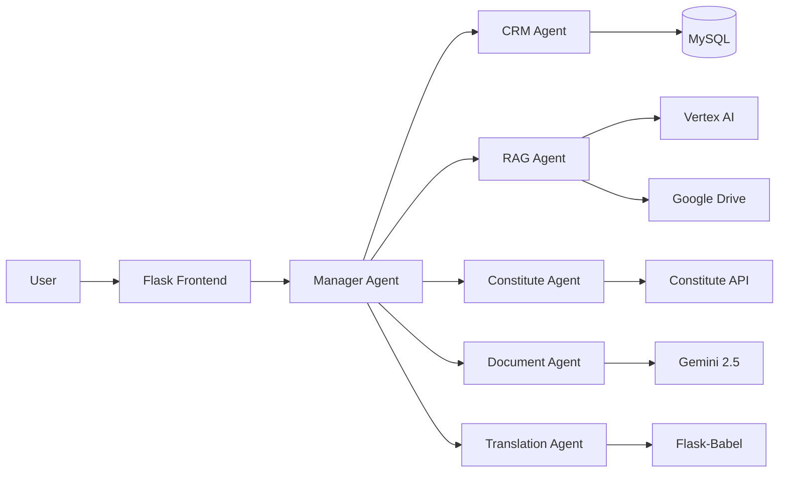
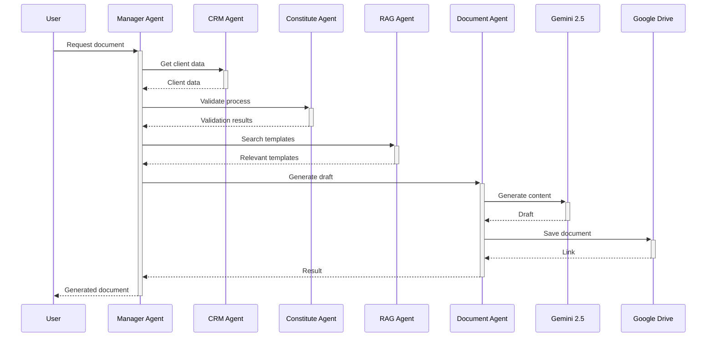
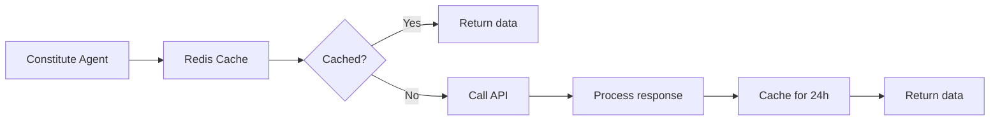
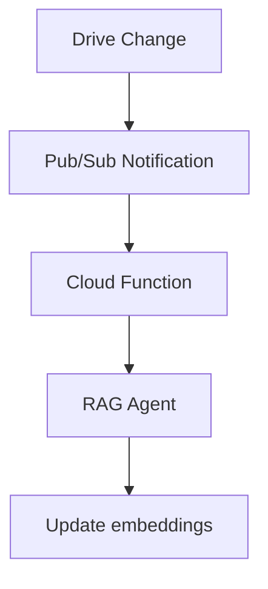
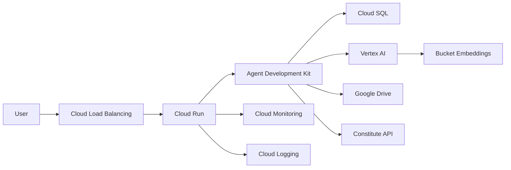

# LegisLink: Multi-Agent Platform for Global Legal Management

## General Technical Vision  
**LegisLink** is a multi-agent system that automates complex legal processes through the orchestration of specialized agents with Google Cloud's ADK. It combines CRM, RAG with Vertex AI, Google Drive integration, and real-time constitutional validation for international lawyers.



## System Architecture

### 1. Directory Structure  
```
legislink-pro/  
├── manager/                      # Root agent  
│   ├── agent.py                  # root_agent: Main orchestrator  
│   ├── workflows.py              # Complex multi-agent flows  
│   └── sub_agents/               # Specialized agents  
│       ├── crm_agent/            # Client management  
│       ├── rag_agent/            # Semantic search  
│       ├── constitute_agent/     # Legal validation  
│       └── document_agent/       # Document generation  
├── services/  
│   ├── google_apis.py            # Drive, Vertex AI  
│   ├── database.py               # MySQL connector  
│   └── constitute_service.py     # Constitute API  
├── api/  
│   ├── app.py                    # Flask REST API  
│   └── auth.py                   # Authentication  
├── static/                       # Frontend  
├── tests/                        # Unit tests  
└── deployment/  
    ├── Dockerfile  
    ├── cloudbuild.yaml           # Google Cloud CI/CD  
    └── terraform/                # Infrastructure as code  
```

### 2. Technology Stack  
| Layer | Technologies |  
|-------|-------------|  
| **Orchestration** | ADK Python, AgentTool |  
| **Storage** | Cloud SQL (MySQL), Google Drive |  
| **AI/ML** | Vertex AI RAG, Gemini 2.5 Flash |  
| **Backend** | Flask, Gunicorn, Cloud Run |  
| **Frontend** | Vue.js, Tailwind CSS |  
| **External APIs** | Constitute Project API, Google Drive API |  
| **Security** | IAP, OAuth 2.0, Cloud KMS |  
| **Monitoring** | Cloud Monitoring, OpenTelemetry |

## Specialized Agents

### 1. CRM Agent  
**Responsibility**: Centralized client and legal case management

```python  
class CRMAgent:  
    def create_client(self, data: dict):  
        # Data validation by jurisdiction  
        if data['country'] in ['MX', 'AR', 'CL']:  
            self._validate_latam_data(data)  
          
        # MySQL connection  
        with MySQLConnection() as db:  
            return db.execute(  
                "INSERT INTO clients (name, country, language) VALUES (%s, %s, %s)",  
                (data['name'], data['country'], data['language'])  
            )  
      
    def _validate_latam_data(self, data):  
        # Specific requirements for Latin America  
        if 'official_id' not in data:  
            raise ValueError("Required: official identification for LATAM")  
```

### 2. RAG Agent  
**Responsibility**: Semantic search in legal documents

```python  
class VertexRAGEnhanced:  
    def __init__(self):  
        self.index_endpoint = aiplatform.MatchingEngineIndexEndpoint(  
            "projects/legislink-pro/locations/us-central1/indexEndpoints/legal-docs"  
        )  
        self.chunking_config = {  
            'chunk_size': 1024,  
            'chunk_overlap': 0.2,  
            'metadata_extraction': {  
                'entity_types': ['LAW', 'ARTICLE', 'JURISPRUDENCE']  
            }  
        }  
      
    def search_documents(self, query: str, country: str, top_k: int = 5):  
        # Multilingual embedding  
        embeddings = multilingual_embedding(query)  
          
        # Country filter  
        filter = [{'namespace': 'country', 'allow_list': [country]}]  
          
        return self.index_endpoint.find_neighbors(  
            queries=embeddings,  
            num_neighbors=top_k,  
            filter=filter  
        )  
```

### 3. Constitute Agent  
**Responsibility**: Constitutional validation

```python  
class ConstituteValidator:  
    CONSTITUTION_API = "https://www.constituteproject.org/service/"  
      
    def validate_process(self, country: str, process: str):  
        # 1. Get current constitution  
        constitution = requests.get(  
            f"{self.CONSTITUTION_API}constitutions?country={country}&historic=false"  
        ).json()[0]  
          
        # 2. Search for relevant articles  
        response = requests.get(  
            f"{self.CONSTITUTION_API}sectionstopicsearch",  
            params={'key': process, 'cons_id': constitution['id']}  
        )  
          
        # 3. Relevance analysis  
        articles = self._filter_articles(response.json(), process)  
          
        return {  
            'country': country,  
            'constitution': constitution['title'],  
            'relevant_articles': articles,  
            'compatibility': self._calculate_compatibility(articles)  
        }  
```

## Key Workflows

### 1. Legal Document Generation  


### 2. Advanced Semantic Search  
```python  
@root_agent.workflow  
def advanced_legal_search(query: str, user_id: str):  
    # 1. Identify jurisdiction  
    client = crm_agent.get_client(user_id)  
    country = client['country']  
      
    # 2. Translate query if necessary  
    if client['language'] != 'en':  
        translated_query = translation_agent.translate(  
            query,   
            source=client['language'],   
            target='en'  
        )  
    else:  
        translated_query = query  
      
    # 3. RAG search in documents  
    results = rag_agent.search_documents(  
        translated_query,  
        country=country,  
        top_k=5  
    )  
      
    # 4. Constitutional validation  
    validation = constitute_agent.validate_query(query, country)  
      
    # 5. Result consolidation  
    return {  
        'results': results,  
        'constitutional_validation': validation,  
        'references': rag_agent.get_sources(results)  
    }  
```

## Data Management

### 1. MySQL Data Model  
```sql  
CREATE TABLE clients (  
    id INT AUTO_INCREMENT PRIMARY KEY,  
    uuid VARCHAR(36) NOT NULL UNIQUE,  
    name VARCHAR(255) NOT NULL,  
    country CHAR(2) NOT NULL CHECK (country REGEXP '^[A-Z]{2}$'),  
    language CHAR(2) NOT NULL DEFAULT 'es',  
    metadata JSON,  
    created_at TIMESTAMP DEFAULT CURRENT_TIMESTAMP  
);

CREATE TABLE documents (  
    id INT AUTO_INCREMENT PRIMARY KEY,  
    client_id INT NOT NULL,  
    drive_id VARCHAR(255) NOT NULL,  
    type ENUM('contract', 'lawsuit', 'appeal', 'other') NOT NULL,  
    constitutionally_valid BOOLEAN DEFAULT FALSE,  
    embedding_hash VARCHAR(64),  # SHA-256 of embeddings  
    FOREIGN KEY (client_id) REFERENCES clients(id)  
);

CREATE TABLE constitutional_validations (  
    id INT AUTO_INCREMENT PRIMARY KEY,  
    document_id INT NOT NULL,  
    articles JSON NOT NULL,  
    compatibility FLOAT CHECK (compatibility BETWEEN 0 AND 1),  
    timestamp TIMESTAMP DEFAULT CURRENT_TIMESTAMP,  
    FOREIGN KEY (document_id) REFERENCES documents(id)  
);  
```

### 2. Vertex AI RAG - Optimizations  
- **Intelligent Chunking**:  
  - Legal paragraph divider (§, Article)  
  - Hierarchy preservation (Title > Chapter > Article)  
  - Enriched metadata:  
    ```json  
    {  
      "jurisdiction": "MX",  
      "document_type": "constitution",  
      "effective_date": "2025-01-01",  
      "entities": ["SCJN", "DOF"]  
    }  
    ```

- **Hybrid Indexing**:  
  ```python  
  def index_document(drive_id: str):  
      # 1. Extract text  
      content = drive_service.get_content(drive_id)  
        
      # 2. Legal processing  
      chunks = legal_chunker(content)  
        
      # 3. Multilingual embeddings  
      embeddings = aiplatform.embed_text_multilingual(  
          texts=[chunk['text'] for chunk in chunks],  
          task_type="RETRIEVAL_DOCUMENT"  
      )  
        
      # 4. Save to Vertex AI  
      index.upsert_datapoints(  
          datapoints=[  
              {  
                  "datapoint_id": f"{drive_id}_{i}",  
                  "feature_vector": emb,  
                  "restricts": [  
                      {"namespace": "country", "allow": [chunk['country']]},  
                      {"namespace": "language", "allow": [chunk['language']]}  
                  ]  
              } for i, emb in enumerate(embeddings)  
          ]  
      )  
  ```

## External API Integration

### 1. Constitute Project API  
**Consumption pattern**:  


**Error handling**:  
```python  
def get_constitution(country: str, max_attempts=3):  
    for attempt in range(max_attempts):  
        try:  
            response = requests.get(  
                f"{BASE_URL}constitutions",  
                params={'country': country, 'historic': 'false'},  
                timeout=5  
            )  
            response.raise_for_status()  
            return response.json()  
          
        except requests.exceptions.HTTPError as e:  
            if e.response.status_code == 404:  
                raise ValueError(f"Constitution not found for {country}")  
            elif e.response.status_code == 429:  
                sleep_time = 2 ** attempt + random.random()  
                time.sleep(sleep_time)  
            else:  
                logger.error(f"HTTP Error: {e}")  
                raise  
```

### 2. Google Drive Integration  
**Synchronization pattern**:  


## Multilingual Support

### Flask-Babel Implementation  
```python  
from flask_babel import Babel, gettext as _

babel = Babel(app)

SUPPORTED_LANGUAGES = ['en', 'es', 'fr', 'pt', 'de']

@babel.localeselector  
def get_locale():  
    # 1. Priority: URL parameter ?lang=  
    if request.args.get('lang') in SUPPORTED_LANGUAGES:  
        return request.args.get('lang')  
      
    # 2. Authenticated user  
    if current_user.is_authenticated:  
        return current_user.language  
      
    # 3. HTTP header  
    return request.accept_languages.best_match(SUPPORTED_LANGUAGES)

# Legal term translation  
LEGAL_TERMS = {  
    'contract': {  
        'en': 'Contract',  
        'es': 'Contrato',  
        'fr': 'Contrat'  
    },  
    'lawsuit': {  
        'en': 'Lawsuit',  
        'es': 'Demanda',  
        'fr': 'Procès'  
    }  
}

def legal_translate(term: str) -> str:  
    locale = get_locale()  
    return LEGAL_TERMS.get(term, {}).get(locale, term)  
```

## Deployment and Operation

### 1. Google Cloud Infrastructure  


### 2. Scalability  
- **Agents**:   
  - Horizontal scaling based on message queue (Pub/Sub)  
  - Max. 100 Cloud Run instances  
- **RAG**:  
  - Distributed indexing with Vertex AI Matching Engine  
  - Geographic region sharding  
- **Database**:  
  - Cloud SQL with read replicas  
  - Auto-scaling from 1 to 32 cores

## Key Innovations

### 1. Automatic Constitutional Validation  
- **Real-Time Verification Pattern**:  
  ```python  
  def generate_document_with_validation():  
      draft = generate_draft()  
        
      # Parallel verification  
      validation_future = executor.submit(  
          constitute_agent.validate_document,   
          draft  
      )  
        
      # Generate preliminary version  
      preliminary_document = format_document(draft)  
        
      # Wait for validation  
      validation_results = validation_future.result()  
        
      if validation_results['compatibility'] < 0.8:  
          return self.correct_unconstitutionalities(  
              preliminary_document,   
              validation_results  
          )  
        
      return preliminary_document  
  ```

### 2. RAG Optimized for Legal Documents  
- **Legal Chunking**:   
  - Preserves hierarchical structure of legal documents  
  - Contextual reconstruction of cross-references  
- **Jurisdiction Filtering**:  
  - Multi-dimensional indexing by country/legal type  
  - Specialized embeddings in legal terminology

### 3. Document Generation System  
- **Dynamic Templates**:  
  ```handlebars  
  {{#each articles}}  
  <article id="{{id}}">  
    <reference>{{country}} {{constitution}} {{title}}</reference>  
    <text>{{text}}</text>  
    <applicability relevance="{{relevance}}">  
      {{explanation}}  
    </applicability>  
  </article>  
  {{/each}}  
  ```  
- **Version Control**:  
  - Modification history in Google Drive  
  - Change audit with Blockchain Ledger (BigTable)

## Performance Metrics

| Component | Metric | Target Value |  
|-----------|--------|--------------|  
| **Document Generation** | P95 Latency | < 8 sec |  
| **Constitutional Validation** | Precision | > 92% |  
| **RAG Search** | Recall@5 | > 0.85 |  
| **Legal Translation** | BLEU Score | > 0.75 |  
| **Complete System** | Uptime | 99.95% |

## ADK Contribution  
1. **Legal Validation Module**:  
   ```python  
   from google.adk.legal import validate_constitution  
     
   class LegalAgent(Agent):  
       def __init__(self):  
           self.add_tool(validate_constitution)  
   ```  
     
2. **Templates for Legal Use Cases**:  
   - Predefined workflows for:  
     - Contract generation  
     - Lawsuit validation  
     - Compliance analysis

3. **Training Dataset**:  
   - 10K+ labeled legal documents  
   - 50+ covered jurisdictions  
   - Specialization in international corporate law

## Technical Conclusion  
**LegisLink Pro** represents an evolution in legal practice through:  
1. **Complete Automation** of complex legal workflows  
2. **Real-Time Constitutional Validation** integrated into the creation process  
3. **Legal Knowledge Management** with advanced RAG  
4. **Global Support** with deep multilingual capabilities

The multi-agent architecture with ADK enables unprecedented scalability and perfect integration with the Google Cloud ecosystem, establishing a new standard in AI-assisted legal tools.
