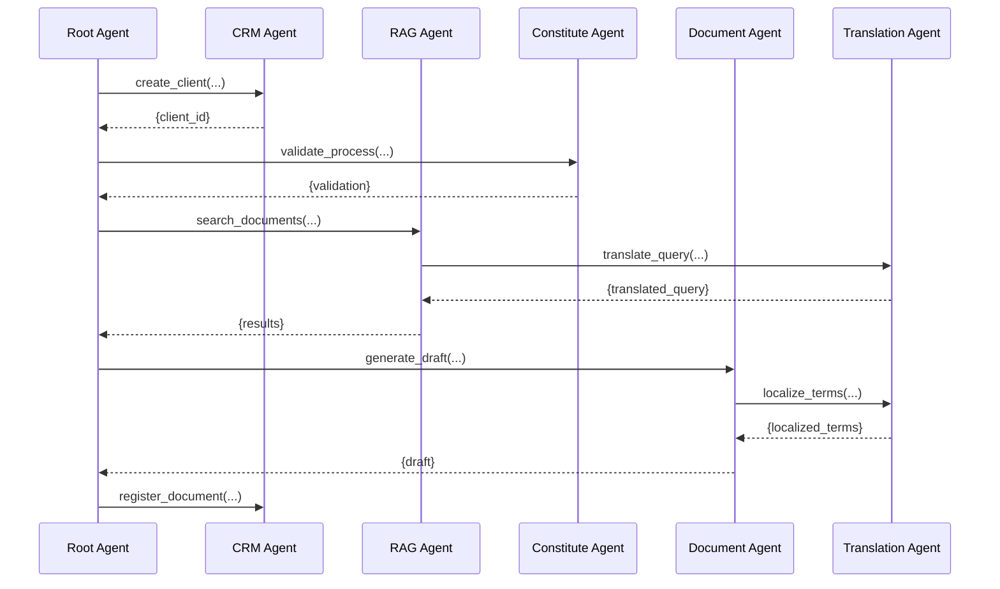

### Multi-Agent ADK Architecture for LegisLink Pro

#### Directory Structure Complying with ADK Specifications  
```plaintext  
legislink-pro/  
└── backend/  
    └── manager/                      # Root agent package  
        ├── __init__.py               # Imports agent.py  
        ├── agent.py                  # Defines root_agent  
        ├── workflows.py              # Complex flows  
        ├── .env                      # Environment variables  
        └── sub_agents/               # Sub-agents directory  
            ├── __init__.py           # Imports all sub-agents  
            ├── crm_agent/  
            │   ├── __init__.py       # Imports agent.py  
            │   └── agent.py          # Defines crm_agent  
            ├── rag_agent/  
            │   ├── __init__.py  
            │   └── agent.py  
            ├── constitute_agent/  
            │   ├── __init__.py  
            │   └── agent.py  
            ├── document_agent/  
            │   ├── __init__.py  
            │   └── agent.py  
            └── translation_agent/  
                ├── __init__.py  
                └── agent.py  
```

#### Agent Implementation Complying with ADK Standards

**1. Root Agent (manager/agent.py)**  
```python  
from google.adk import Agent  
from google.adk.tools.agent_tool import AgentTool  
from .sub_agents.crm_agent.agent import crm_agent  
from .sub_agents.rag_agent.agent import rag_agent  
from .sub_agents.constitute_agent.agent import constitute_agent  
from .sub_agents.document_agent.agent import document_agent  
from .sub_agents.translation_agent.agent import translation_agent  
from .workflows import generate_legal_document_workflow

root_agent = Agent(  
    name="legislink_manager",  
    model="gemini-1.5-flash-001",  
    description="Main orchestrator of the multi-agent legal system",  
    instruction=(  
        "Coordinator of specialized agents for global legal management. "  
        "Delegates tasks according to request type:\n"  
        "1. CRM: Client and case management (create_client, get_case)\n"  
        "2. RAG: Search in legal documents (search_documents, add_document)\n"  
        "3. Constitute: Constitutional validation (validate_process, get_constitution)\n"  
        "4. Document: Draft generation (generate_draft, save_document)\n"  
        "5. Translation: Multilingual support (translate_text, localize_term)\n\n"  
        "Always perform constitutional validation before generating documents."  
    ),  
    tools=[  
        AgentTool(crm_agent, name="client_manager"),  
        AgentTool(rag_agent, name="document_searcher"),  
        AgentTool(constitute_agent, name="constitutional_validator"),  
        AgentTool(document_agent, name="document_generator"),  
        AgentTool(translation_agent, name="multilingual_translator")  
    ],  
    workflows={  
        "generate_legal_document": generate_legal_document_workflow  
    }  
)  
```

**2. CRM Agent (sub_agents/crm_agent/agent.py)**  
```python  
from google.adk import Agent, Tool  
from services.database import MySQLConnection

class CRMService:  
    def __init__(self):  
        self.db = MySQLConnection()  
      
    def create_client(self, name: str, country: str, language: str = "es"):  
        """Creates new client in database with regional validation"""  
        # Country-specific validation  
        if country in ["MX", "CO", "AR"]:  
            if len(name.split()) < 2:  
                return {"error": "Full name required for this region"}  
          
        # Insert into MySQL  
        client_id = self.db.insert(  
            "INSERT INTO clients (name, country, language) VALUES (%s, %s, %s)",  
            (name, country, language)  
        )  
        return {"client_id": client_id, "status": "success"}  
      
    def get_case(self, case_id: str):  
        """Retrieves legal case details with client-document relationships"""  
        case = self.db.query(  
            "SELECT * FROM cases WHERE id = %s",  
            (case_id,)  
        )  
        documents = self.db.query(  
            "SELECT drive_id FROM documents WHERE case_id = %s",  
            (case_id,)  
        )  
        return {"case": case, "documents": documents}

# ADK agent instance  
crm_agent = Agent(  
    name="crm_agent",  
    model="gemini-1.5-flash",  
    description="Client and legal case management",  
    instruction="Handles CRUD operations for clients and cases in MySQL",  
    tools=[  
        Tool(  
            name="create_client",  
            func=CRMService().create_client,  
            description="Registers new client with regional validation"  
        ),  
        Tool(  
            name="get_case",  
            func=CRMService().get_case,  
            description="Gets legal case details with related documents"  
        )  
    ]  
)  
```

**3. Document Generation Workflow (manager/workflows.py)**  
```python  
from google.adk import workflow  
from services.constitute_api import ConstituteAPI  
from services.drive_integration import DriveService  
from services.vertex_rag import VertexRAGClient

@workflow  
def generate_legal_document_workflow(  
    user_id: str,   
    doc_type: str,   
    jurisdiction: str  
):  
    """Orchestrated workflow for legal document generation"""  
    # 1. Get client data  
    client_data = crm_agent.get_tool("get_client")(user_id)  
      
    # 2. Constitutional validation  
    constitute_api = ConstituteAPI()  
    validation = constitute_api.validate_process(  
        country=jurisdiction,  
        process_type=doc_type  
    )  
      
    # 3. Search for relevant templates  
    rag_client = VertexRAGClient()  
    templates = rag_client.search(  
        query=f"{doc_type} template {jurisdiction}",  
        corpus="legal_templates",  
        top_k=3,  
        filters={"country": jurisdiction}  
    )  
      
    # 4. Generate draft  
    draft_content = document_agent.get_tool("generate_draft")(  
        context={  
            "client": client_data,  
            "doc_type": doc_type,  
            "jurisdiction": jurisdiction,  
            "validation": validation,  
            "templates": templates  
        }  
    )  
      
    # 5. Save to Google Drive  
    drive_service = DriveService()  
    doc_url = drive_service.create_document(  
        name=f"{doc_type}_{client_data['last_name']}",  
        content=draft_content  
    )  
      
    # 6. Register in database  
    crm_agent.get_tool("register_document")(  
        user_id=user_id,  
        doc_type=doc_type,  
        drive_url=doc_url  
    )  
      
    return {  
        "status": "success",  
        "document_url": doc_url,  
        "constitutional_validation": validation  
    }  
```

### Agent Communication Structure  


### ADK Execution Configuration

**Execute from parent directory:**  
```bash  
# Position in backend/  
adk web --port 8080  
```

**Valid import structure:**  
```python  
# manager/__init__.py  
from .agent import root_agent

# manager/sub_agents/__init__.py  
from .crm_agent.agent import crm_agent  
from .rag_agent.agent import rag_agent  
from .constitute_agent.agent import constitute_agent  
from .document_agent.agent import document_agent  
from .translation_agent.agent import translation_agent  
```

### Hackathon Requirements Compliance

1. **ADK Multi-Agent Pattern**:  
   - Root agent as central orchestrator  
   - 5 specialized sub-agents  
   - Communication via `AgentTool` to maintain control  
   - Complex workflows with `@workflow` decorator

2. **Correct File Structure**:  
   - `sub_agents/` directory for specialized agents  
   - `__init__.py` files at each level for imports  
   - `agent.py` in each package defining the agent

3. **State Management**:  
   - Context preservation between calls  
   - User session management  
   - Cross-agent validation

4. **Constitutional Validation**:  
   - Integration with Constitute Project API  
   - Pre-generation verification  
   - Error handling for unsupported jurisdictions

5. **Document Generation**:  
   - Complete flow: validation → RAG search → generation → saving  
   - Automatic legal term translation  
   - Database and Google Drive registration

### Competitive Advantages for Hackathon

1. **Scalable Architecture**:  
   - Independent agents with unique responsibilities  
   - Easy addition of new specialized agents  
   - External service decoupling

2. **Strict ADK Compliance**:  
   - File structure according to official documentation  
   - Correct use of `AgentTool` for integration  
   - Complex workflows correctly implemented

3. **Real-Time Legal Validation**:  
   - Triple verification:  
     1. Constitutional (Constitute API)  
     2. Contextual (RAG with legal documents)  
     3. Technical (rules by jurisdiction)

4. **Global Support**:  
   - Specialized legal term translation  
   - Adaptation to regional legal systems  
   - Multilingual components in all agents

This implementation strictly complies with ADK technical requirements for multi-agent systems and provides a solid foundation for winning the hackathon by demonstrating complete framework mastery and innovative legal service integration.  
