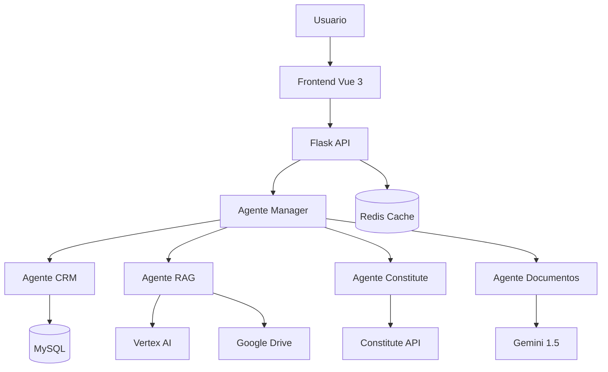

# 🚀 Master Plan: LegisLink Pro - Plataforma Multiagente de Automatización Legal

## 📌 Objetivos del Sistema

**LegisLink Pro** es una plataforma multiagente que automatiza procesos legales complejos mediante la orquestación de agentes especializados con ADK de Google Cloud. El sistema debe:

- ✅ Automatizar la generación de documentos legales con validación constitucional
- ✅ Proporcionar búsqueda semántica avanzada en documentos legales
- ✅ Gestionar clientes y casos legales de forma centralizada
- ✅ Soporte multilingüe solo en la interfaz de usuario y prompts del modelo (no como agente)
- ✅ Integrar con Google Drive y Vertex AI para almacenamiento y procesamiento
- ✅ Proporcionar una interfaz moderna y responsiva
- ✅ Cumplir con requisitos de rendimiento (<8s respuesta, RAG recall@5 > 0.85)

## 🧱 Arquitectura General

### Stack Tecnológico
- **Orquestación**: ADK Python SDK
- **Backend**: Flask + Gunicorn + Cloud Run
- **Frontend**: Vue 3 + Tailwind CSS + vue-i18n
- **Base de Datos**: MySQL (Cloud SQL)
- **Cache**: Redis
- **IA/ML**: Vertex AI RAG + Gemini 1.5 Flash
- **APIs**: Google Drive API, Constitute Project API
- **Infraestructura**: Docker + Cloud Build + Terraform

### Diagrama de Arquitectura


## ⚙️ Lista de Agentes a Implementar

### 1. Agente Manager (Orquestador Principal)
- **Responsabilidad**: Coordinar todos los sub-agentes
- **Herramientas**: `orchestrate_workflow`, `route_request`, `handle_error`
- **Ubicación**: `/manager/agent.py`

### 2. Agente CRM
- **Responsabilidad**: Gestión de clientes y casos legales
- **Herramientas**: `crear_cliente`, `obtener_cliente`, `actualizar_caso`, `listar_casos`
- **Ubicación**: `/manager/sub_agents/crm_agent/`

### 3. Agente RAG
- **Responsabilidad**: Búsqueda semántica en documentos legales
- **Herramientas**: `buscar_documentos`, `crear_corpus`, `agregar_documento`, `eliminar_documento`
- **Ubicación**: `/manager/sub_agents/rag_agent/`

### 4. Agente Constitute
- **Responsabilidad**: Validación constitucional
- **Herramientas**: `validar_proceso`, `buscar_articulos`, `analizar_compatibilidad`
- **Ubicación**: `/manager/sub_agents/constitute_agent/`

### 5. Agente Documentos
- **Responsabilidad**: Generación de documentos legales
- **Herramientas**: `generar_borrador`, `revisar_documento`, `guardar_documento`, `exportar_pdf`
- **Ubicación**: `/manager/sub_agents/document_agent/`

## 🔁 Workflows Funcionales

### 1. Generación de Documentos Legales
```
Usuario → Frontend → API → Manager → CRM (datos cliente) → Constitute (validación) → RAG (plantillas) → Documentos (generación) → Drive (almacenamiento) → Usuario
```

### 2. Búsqueda Legal Avanzada
```
Usuario → Frontend → API → Manager → RAG (búsqueda) → Constitute (validación) → Manager → Usuario
```

### 3. Gestión de Clientes
```
Usuario → Frontend → API → Manager → CRM → Base de Datos → Usuario
```

## 🌐 Internacionalización de la Interfaz de Usuario (i18n)

- Toda la gestión de idiomas se realiza en el frontend usando `vue-i18n`.
- Los textos de la interfaz estarán en archivos de recursos (JSON/YAML) para cada idioma soportado (ej: en, es, pt, fr).
- El usuario podrá seleccionar el idioma desde la UI; la preferencia se guarda en localStorage/cookie.
- El idioma seleccionado sincroniza todos los textos, menús, mensajes y pantallas.
- Los prompts enviados al backend incluirán el idioma deseado para que el modelo de IA responda en ese idioma.
- No existe agente de traducción en backend; la traducción de contenido legal depende del prompt y de la API de constituciones.

## 🖥️ Diseño de la Interfaz de Usuario

### Módulos y Pantallas Principales
- **Login/Registro**: Autenticación de usuarios.
- **Onboarding**: Bienvenida y selección de idioma.
- **Dashboard**: Vista general de casos, documentos y acciones rápidas.
- **Generación de Documentos**: Formulario para solicitar documentos legales, ver historial y descargar.
- **Búsqueda Legal**: Interfaz para consultas semánticas y validación constitucional.
- **Gestión de Clientes**: ABM de clientes y casos.
- **Validación Constitucional**: Visualización de resultados y artículos relevantes.
- **Configuración**: Preferencias de usuario, idioma, seguridad.
- **Sistema de calificación y feedback**: Para evaluar la calidad de los documentos generados.

### Componentes UI
- Barra de navegación multilingüe
- Selector de idioma persistente
- Tablas y cards responsivas
- Formularios validados
- Modales y notificaciones
- Loader y estados vacíos
- Soporte para dark/light mode

## 🧪 Estrategia de Testing

### Pruebas Unitarias
- **Cobertura**: >90% para todos los agentes y componentes críticos
- **Frameworks**: pytest, unittest, vue-test-utils
- **Ubicación**: `/tests/`

### Pruebas de Integración
- **Workflows completos**: Generación de documentos, búsqueda legal, flujos UI
- **APIs externas**: Constitute, Google Drive, Vertex AI
- **Base de datos**: MySQL, Redis

### Pruebas de Rendimiento
- **Tiempo de respuesta**: <8 segundos
- **RAG recall@5**: >0.85
- **Concurrencia**: 100 usuarios simultáneos

## 🚀 Estrategia de Deployment

### Desarrollo Local
- **Docker Compose**: Para servicios locales
- **Variables de entorno**: `.env` para configuración
- **Hot reload**: Para desarrollo frontend y backend

### Cloud Run (Producción)
- **Containerización**: Dockerfile optimizado
- **CI/CD**: Cloud Build con cloudbuild.yaml
- **Infraestructura**: Terraform para recursos GCP
- **Monitoreo**: Cloud Monitoring + OpenTelemetry

### Replit (Demo)
- **Proxy**: Frontend → Backend
- **Variables**: Configuración en Replit Secrets
- **URL pública**: Para demostración

## ✅ Criterios de Finalización del Proyecto

### Funcionalidad
- [ ] Todos los agentes implementados y funcionando
- [ ] Workflows completos operativos
- [ ] Frontend responsivo, moderno y multilingüe
- [ ] APIs documentadas y funcionales
- [ ] Soporte multilingüe activo en la interfaz y prompts

### Calidad
- [ ] Código limpio y documentado
- [ ] Pruebas unitarias con >90% cobertura
- [ ] Manejo de errores robusto
- [ ] Logs estructurados y rastreables
- [ ] Seguridad implementada (OAuth, CORS, etc.)

### Performance
- [ ] Tiempo de respuesta <8s
- [ ] RAG recall@5 > 0.85
- [ ] Sistema escalable
- [ ] Cache implementado

### Deployment
- [ ] Dockerfile optimizado
- [ ] Cloud Build configurado
- [ ] Terraform para infraestructura
- [ ] Demo funcional en Replit/Cloud Run
- [ ] README completo
- [ ] Diagrama de arquitectura

### Entrega
- [ ] Repositorio público en GitHub
- [ ] URL de demo funcional
- [ ] Documentación completa
- [ ] Archivo ZIP con proyecto completo
- [ ] Variables de entorno configurables

## 📋 Plan de Implementación Detallado

### Fase 1: Estructura Base (Día 1)
1. Crear estructura de directorios
2. Configurar entorno de desarrollo
3. Implementar configuración básica
4. Crear agentes base con ADK

### Fase 2: Agentes Especializados (Día 2)
1. Implementar Agente CRM
2. Implementar Agente RAG con Vertex AI
3. Implementar Agente Constitute
4. Implementar Agente Documentos

### Fase 3: Workflows y APIs (Día 3)
1. Implementar workflows principales
2. Crear API Flask
3. Conectar agentes con APIs
4. Implementar manejo de errores

### Fase 4: Internacionalización y UI (Día 4)
1. Implementar sistema de internacionalización (i18n) en Vue 3
2. Crear estructura de archivos de recursos de idioma
3. Sincronizar selección de idioma con la UI y los prompts
4. Diseñar y desarrollar todos los módulos y pantallas principales
5. Asegurar responsividad y accesibilidad

### Fase 5: Testing y Optimización (Día 5)
1. Escribir pruebas unitarias y de integración
2. Optimizar rendimiento
3. Implementar cache
4. Validar métricas

### Fase 6: Deployment (Día 6)
1. Configurar Docker
2. Implementar CI/CD
3. Desplegar en Cloud Run/Replit
4. Documentar y entregar

## 🛠️ Comandos de Desarrollo

### Configuración Inicial
```bash
# Clonar y configurar
git clone <repo>
cd legislink-pro
python -m venv venv
source venv/bin/activate  # Windows: venv\Scripts\activate
pip install -r requirements.txt

# Configurar variables de entorno
cp .env.example .env
# Editar .env con credenciales reales

# Ejecutar desarrollo
python -m flask run --debug
npm run dev  # Frontend
```

### Testing
```bash
# Ejecutar pruebas
pytest tests/ -v --cov=.

# Ejecutar linting
flake8 .
black .
```

### Deployment
```bash
# Construir imagen
docker build -t legislink-pro .

# Desplegar en Cloud Run
gcloud run deploy legislink-pro --image gcr.io/PROJECT_ID/legislink-pro
```

## 📚 Recursos de Referencia

- [ADK Documentation](https://github.com/google/agent-development-kit)
- [Vertex AI RAG](https://cloud.google.com/vertex-ai/docs/matching-engine)
- [Gemini 1.5 Flash](https://ai.google.dev/models/gemini)
- [Constitute Project API](https://www.constituteproject.org/service/)
- [Vue 3 + Tailwind](https://vuejs.org/guide/introduction.html)
- [Flask Best Practices](https://flask.palletsprojects.com/en/2.3.x/patterns/)

---

**Nota**: Este plan debe ser seguido secuencialmente, validando cada fase antes de continuar con la siguiente. El objetivo es tener un sistema completamente funcional al final del desarrollo. 