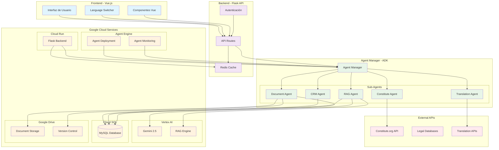
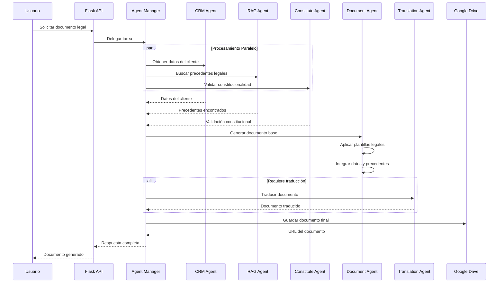
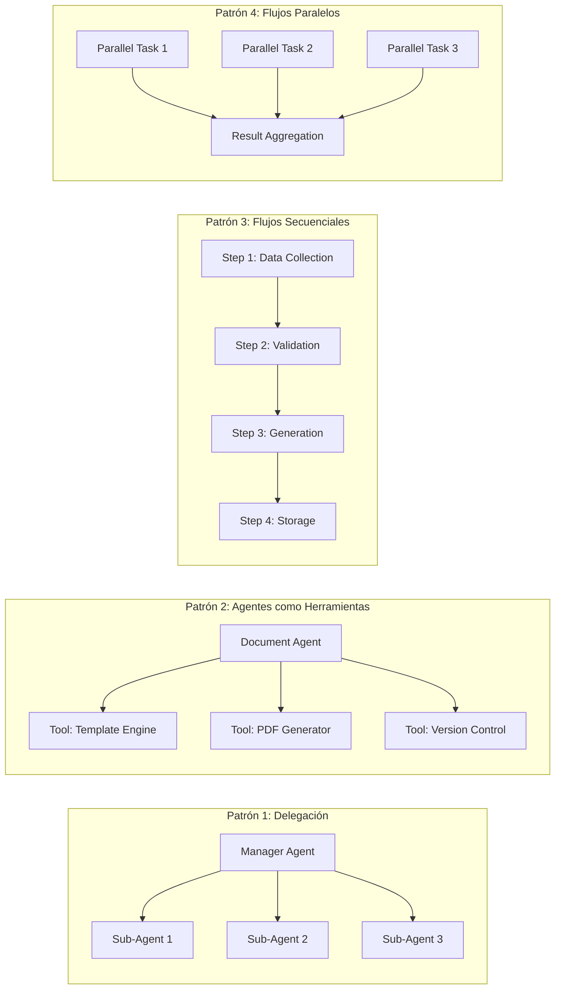
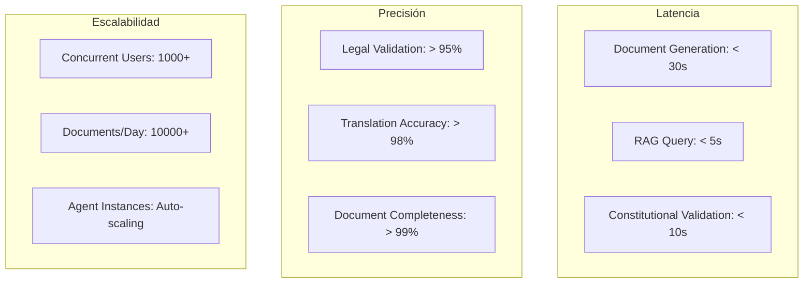

# LegisLink Pro - Diagrama de Arquitectura

## Arquitectura Multiagente con Google Cloud

```mermaid
graph TB
    subgraph "Frontend - Vue.js"
        UI[Interfaz de Usuario]
        Lang[Language Switcher]
        Components[Componentes Vue]
    end

    subgraph "Backend - Flask API"
        API[API Routes]
        Auth[Autenticación]
        Cache[Redis Cache]
    end

    subgraph "Agent Manager - ADK"
        Manager[Agent Manager]
        
        subgraph "Sub-Agents"
            CRM[CRM Agent]
            RAG[RAG Agent]
            Constitute[Constitute Agent]
            Document[Document Agent]
            Translation[Translation Agent]
        end
    end

    subgraph "Google Cloud Services"
        subgraph "Vertex AI"
            Gemini[Gemini 2.5]
            RAG_Engine[RAG Engine]
        end
        
        subgraph "Agent Engine"
            Agent_Deploy[Agent Deployment]
            Agent_Monitor[Agent Monitoring]
        end
        
        subgraph "Cloud SQL"
            MySQL[(MySQL Database)]
        end
        
        subgraph "Google Drive"
            Drive[Document Storage]
            Version_Control[Version Control]
        end
        
        subgraph "Cloud Run"
            Backend[Flask Backend]
        end
    end

    subgraph "External APIs"
        Constitute_API[Constitute.org API]
        Legal_DB[Legal Databases]
        Translation_API[Translation APIs]
    end

    %% Frontend connections
    UI --> API
    Lang --> API
    Components --> API

    %% Backend connections
    API --> Manager
    API --> Cache
    Auth --> API

    %% Agent Manager connections
    Manager --> CRM
    Manager --> RAG
    Manager --> Constitute
    Manager --> Document
    Manager --> Translation

    %% Agent to Cloud Services
    RAG --> RAG_Engine
    RAG --> Gemini
    Constitute --> Constitute_API
    Document --> Drive
    Document --> Version_Control
    Translation --> Translation_API

    %% Database connections
    CRM --> MySQL
    RAG --> MySQL
    Document --> MySQL

    %% Cloud Run deployment
    Backend --> Manager
    Backend --> Cache

    %% Agent Engine
    Agent_Deploy --> Manager
    Agent_Monitor --> Manager

    %% Styling
    classDef frontend fill:#e1f5fe
    classDef backend fill:#f3e5f5
    classDef agents fill:#e8f5e8
    classDef cloud fill:#fff3e0
    classDef external fill:#ffebee

    class UI,Lang,Components frontend
    class API,Auth,Cache backend
    class Manager,CRM,RAG,Constitute,Document,Translation agents
    class Gemini,RAG_Engine,Agent_Deploy,Agent_Monitor,MySQL,Drive,Version_Control,Backend cloud
    class Constitute_API,Legal_DB,Translation_API external
```

## Flujo de Generación de Documentos Legales

```mermaid
sequenceDiagram
    participant U as Usuario
    participant API as Flask API
    participant M as Agent Manager
    participant CRM as CRM Agent
    participant RAG as RAG Agent
    participant C as Constitute Agent
    participant D as Document Agent
    participant T as Translation Agent
    participant G as Google Drive

    U->>API: Solicitar documento legal
    API->>M: Delegar tarea
    
    par Procesamiento Paralelo
        M->>CRM: Obtener datos del cliente
        M->>RAG: Buscar precedentes legales
        M->>C: Validar constitucionalidad
    end
    
    CRM-->>M: Datos del cliente
    RAG-->>M: Precedentes encontrados
    C-->>M: Validación constitucional
    
    M->>D: Generar documento base
    D->>D: Aplicar plantillas legales
    D->>D: Integrar datos y precedentes
    
    alt Requiere traducción
        M->>T: Traducir documento
        T-->>M: Documento traducido
    end
    
    M->>G: Guardar documento final
    G-->>M: URL del documento
    M-->>API: Respuesta completa
    API-->>U: Documento generado
```

## Patrones ADK Implementados

```mermaid
graph LR
    subgraph "Patrón 1: Delegación"
        A[Manager Agent] --> B[Sub-Agent 1]
        A --> C[Sub-Agent 2]
        A --> D[Sub-Agent 3]
    end

    subgraph "Patrón 2: Agentes como Herramientas"
        E[Document Agent] --> F[Tool: Template Engine]
        E --> G[Tool: PDF Generator]
        E --> H[Tool: Version Control]
    end

    subgraph "Patrón 3: Flujos Secuenciales"
        I[Step 1: Data Collection] --> J[Step 2: Validation]
        J --> K[Step 3: Generation]
        K --> L[Step 4: Storage]
    end

    subgraph "Patrón 4: Flujos Paralelos"
        M[Parallel Task 1] --> N[Result Aggregation]
        O[Parallel Task 2] --> N
        P[Parallel Task 3] --> N
    end
```

## Métricas de Desempeño

```mermaid
graph TD
    subgraph "Latencia"
        L1[Document Generation: < 30s]
        L2[RAG Query: < 5s]
        L3[Constitutional Validation: < 10s]
    end

    subgraph "Precisión"
        P1[Legal Validation: > 95%]
        P2[Translation Accuracy: > 98%]
        P3[Document Completeness: > 99%]
    end

    subgraph "Escalabilidad"
        E1[Concurrent Users: 1000+]
        E2[Documents/Day: 10000+]
        E3[Agent Instances: Auto-scaling]
    end
``` 